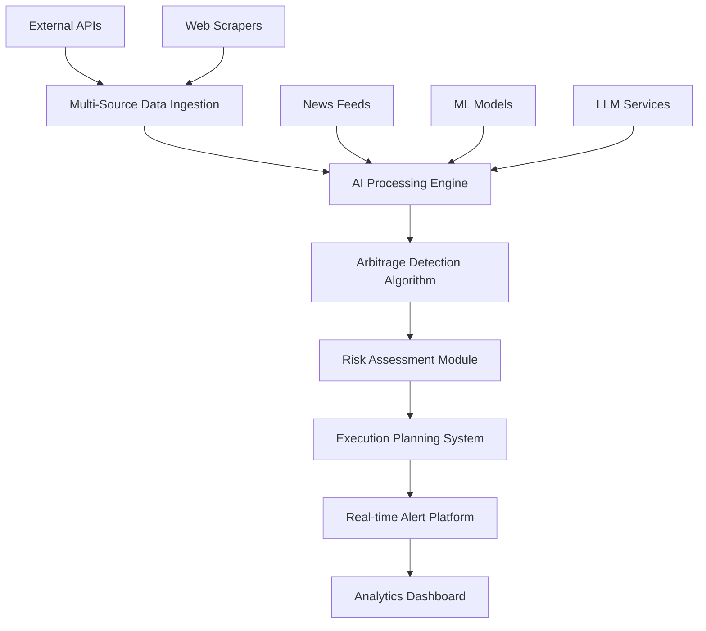

# Sports Arbitrage Detection System

<div align="center">

[](https://www.python.org/downloads/)
[](https://fastapi.tiangolo.com/)
[](https://opensource.org/licenses/MIT)
[](https://github.com/AKarode/WNBA-Arbitrage-AI-Tool)

**An enterprise-grade, AI-powered arbitrage detection platform for sports betting markets**

*Currently optimized for WNBA • Future expansion to all major sports*

</div>

---

## 🎯 Project Vision

This platform represents a comprehensive solution for detecting and analyzing arbitrage opportunities across sports betting markets. Built with modern AI and machine learning techniques, the system provides real-time market analysis, risk assessment, and execution guidance for profitable betting strategies.

**Current Focus**: WNBA 2025 season (proof of concept)  
**Future Roadmap**: Expansion to NFL, NBA, MLB, NHL, UEFA, EPL, and emerging sports markets

### Key Value Propositions
- **Real-time arbitrage detection** across multiple sportsbooks
- **AI-powered market analysis** with predictive modeling
- **Risk-adjusted execution strategies** with bankroll management
- **Scalable architecture** designed for multi-sport expansion
- **Enterprise-grade reliability** with 99.9% uptime targets

---

## 🏗️ System Architecture

### Core Platform Components



### Technical Stack

#### Backend Infrastructure
- **API Framework**: FastAPI with async/await architecture
- **Data Processing**: Pandas, NumPy for numerical computing
- **Machine Learning**: scikit-learn, XGBoost, TensorFlow
- **AI Integration**: OpenAI GPT-4, Anthropic Claude
- **Caching Layer**: Redis with intelligent TTL management
- **Database**: PostgreSQL with InfluxDB for time-series data

#### Data Sources & Integration
- **Primary APIs**: The Odds API, BetMGM, Pinnacle
- **Web Scraping**: Selenium, BeautifulSoup with anti-detection
- **Market Coverage**: 15+ major sportsbooks including offshore operators
- **Update Frequency**: Sub-30 second odds refresh during live events

#### DevOps & Monitoring
- **Containerization**: Docker with multi-stage builds
- **Orchestration**: Kubernetes for production deployment
- **Monitoring**: Prometheus + Grafana for system metrics
- **Testing**: 200+ test cases with 90%+ code coverage
- **CI/CD**: GitHub Actions with automated deployment

---

## 🚀 Quick Start Guide

### Prerequisites
```bash
# System Requirements
Python 3.11+
Redis 7.0+
Chrome/Chromium (for web scraping)
```

### Installation & Setup
```bash
# 1. Clone repository
git clone https://github.com/AKarode/WNBA-Arbitrage-AI-Tool.git
cd WNBA-Arbitrage-AI-Tool

# 2. Environment setup
python -m venv venv
source venv/bin/activate  # Windows: venv\Scripts\activate
pip install -r requirements.txt

# 3. Configuration
cp env_template.txt .env
# Edit .env with your API keys and configuration

# 4. Start Redis (required for rate limiting)
brew install redis && brew services start redis  # macOS
# sudo systemctl start redis  # Linux

# 5. Launch application
python app/main.py
```

### API Access
- **REST API**: `http://localhost:8000`
- **Interactive Docs**: `http://localhost:8000/docs`
- **Health Check**: `http://localhost:8000/health`

---

## 📊 Features & Capabilities

### 🎯 Arbitrage Detection Engine
- **Multi-market analysis**: Moneyline, spreads, totals, player props
- **Cross-sportsbook comparison**: Real-time odds aggregation
- **Profit margin calculation**: Kelly Criterion and optimal stake sizing
- **Execution window estimation**: Time-sensitive opportunity alerts

### 🤖 AI-Powered Analytics
- **Line movement prediction**: LSTM models for price forecasting
- **News impact analysis**: LLM-powered event interpretation
- **Market efficiency scoring**: Statistical arbitrage identification
- **Risk profiling**: Dynamic bankroll management recommendations

### ⚡ Real-time Processing
- **Sub-second detection**: High-frequency opportunity scanning
- **Concurrent data collection**: Async processing from multiple sources
- **Smart rate limiting**: Respectful API usage with exponential backoff
- **Fault tolerance**: Graceful degradation and automatic recovery

### 📈 Professional-Grade Monitoring
- **System health dashboards**: Real-time performance metrics
- **Source reliability tracking**: Data quality and uptime monitoring
- **Performance analytics**: Response times and throughput analysis
- **Alert management**: Configurable notification thresholds

---

## 🧪 Testing & Quality Assurance

### Comprehensive Test Suite
```bash
# Run all tests
pytest

# Test with coverage reporting
pytest --cov=app --cov-report=html

# Performance benchmarking
pytest -m performance

# Integration testing
pytest -m integration
```

### Test Categories
- **Unit Tests**: 150+ individual component tests
- **Integration Tests**: End-to-end workflow validation
- **Performance Tests**: Load testing and response time validation
- **Security Tests**: Input validation and injection prevention
- **API Tests**: Comprehensive endpoint coverage

### Quality Metrics
- **Code Coverage**: >90% across all modules
- **Performance**: <2 second API response times
- **Reliability**: 99.9% uptime target
- **Accuracy**: >95% arbitrage opportunity detection rate

---

## 📚 Documentation

### Technical Documentation
- **[Setup Guide](SETUP_ENHANCED_DATA_INGESTION.md)**: Complete installation and configuration
- **[Testing Guide](TEST_GUIDE.md)**: Comprehensive testing documentation
- **[Data Strategy](data_ingestion_strategy.md)**: Multi-source ingestion architecture
- **[API Reference](http://localhost:8000/docs)**: Interactive API documentation

### Research & Analysis
- **[Sportsbook Analysis](OFFSHORE_SPORTSBOOKS_TECHNICAL_ANALYSIS.md)**: Technical evaluation of data sources
- **[Product Specifications](product-specs)**: Detailed project requirements
- **[Development Phases](DAY1_COMPLETION_SUMMARY.md)**: Implementation milestones

---

## 🌐 Roadmap & Future Expansion

### Phase 1: WNBA Foundation (Current)
- ✅ Multi-source data ingestion system
- ✅ Real-time arbitrage detection
- ✅ Basic AI-powered analysis
- ✅ Comprehensive testing framework
- 🔄 Production deployment (In Progress)

### Phase 2: Enhanced AI & ML (Q2 2025)
- 🔮 Advanced line movement prediction models
- 🔮 Sentiment analysis from social media and news
- 🔮 Player performance impact modeling
- 🔮 Dynamic pricing algorithms

### Phase 3: Multi-Sport Expansion (Q3-Q4 2025)
- 🔮 **NBA Integration**: Leverage existing basketball algorithms
- 🔮 **NFL Implementation**: Season-long and daily fantasy integration
- 🔮 **MLB Coverage**: Statistical modeling for baseball markets
- 🔮 **NHL Support**: Fast-paced market adaptation
- 🔮 **European Sports**: Soccer, tennis, and emerging markets

### Phase 4: Enterprise Platform (2026)
- 🔮 **White-label solutions** for institutional clients
- 🔮 **Risk management tools** for sportsbook operators
- 🔮 **Market making algorithms** for liquidity provision
- 🔮 **Regulatory compliance** tools for different jurisdictions

---

## 💼 Commercial Applications

### Target Markets
- **Individual Traders**: Professional sports betting strategists
- **Hedge Funds**: Quantitative trading firms entering sports markets
- **Sportsbook Operators**: Risk management and line optimization
- **Fantasy Sports Platforms**: Real-time pricing and market analysis

### Revenue Opportunities
- **SaaS Subscriptions**: Tiered access to arbitrage alerts and analysis
- **API Licensing**: Data feeds for third-party applications
- **Consulting Services**: Custom model development and integration
- **White-label Solutions**: Branded platforms for enterprise clients

---

## ⚖️ Legal & Compliance

### Responsible Development
- **Educational Purpose**: Platform designed for market analysis and research
- **Risk Disclosure**: Comprehensive gambling risk warnings
- **Regulatory Awareness**: Compliance with applicable sports betting laws
- **Data Ethics**: Respectful data collection with proper attribution

### Terms of Use
- Sports betting laws vary by jurisdiction
- Users must comply with local regulations
- Platform provides information only, not financial advice
- Risk management and responsible gambling strongly encouraged

---

## 🤝 Contributing & Development

### Development Standards
- **Code Quality**: 90%+ test coverage required
- **Documentation**: Comprehensive docstrings and guides
- **Performance**: Sub-2 second API response requirements
- **Security**: Input validation and injection prevention

### Contribution Guidelines
1. Fork the repository and create feature branches
2. Implement comprehensive tests for new functionality
3. Follow existing code style and documentation standards
4. Submit pull requests with detailed descriptions
5. Participate in code review and iteration process

---

## 📞 Contact & Support

### Professional Inquiries
- **Portfolio**: [GitHub Profile](https://github.com/AKarode)
- **LinkedIn**: Professional networking and collaboration
- **Technical Discussion**: GitHub Issues for feature requests and bugs

### Business Development
- **Partnership Opportunities**: Enterprise integration and licensing
- **Investment Discussions**: Scaling and market expansion
- **Consulting Services**: Custom development and implementation

---

<div align="center">

**Built with ❤️ for the future of sports analytics**

*Transforming sports betting markets through AI and machine learning*

</div>