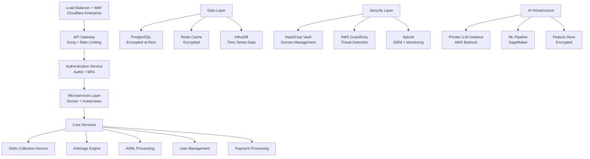

# Sports Arbitrage Detection System - Development Roadmap

<div align="center">

**Secure, AI-Enhanced Multi-Sport Arbitrage Platform**  
*Feature-by-Feature Implementation Guide with Security Integration*

**Version 2.0** | **18-Month Development Cycle** | **Security-First Architecture**

</div>

---

## 🎯 Development Philosophy

### Core Principles
1. **Security by Design**: Every feature built with security controls from day one
2. **AI-First Approach**: LLM and ML integration in all major features
3. **California Compliance**: CCPA, data privacy, and offshore market focus
4. **Scalable Architecture**: Designed for 10,000+ concurrent users
5. **Test-Driven Development**: 90%+ code coverage with automated testing

### Success Metrics
- **Technical**: 99.9% uptime, <200ms API response, SOC 2 compliance
- **Business**: $285K MRR by Month 24, 8,000+ users, 22:1 LTV:CAC
- **Security**: Zero data breaches, <1 security incident per quarter

---

## 🏗️ Technical Architecture Overview

### Security-First Infrastructure Stack



### Security Framework Integration
- **Zero Trust Architecture**: Every request authenticated and authorized
- **Defense in Depth**: Multiple security layers with fail-safe mechanisms
- **Privacy by Design**: CCPA compliance built into every data collection point
- **AI Security**: Private LLM deployment with input/output filtering

---

## 📅 Phase 1: Foundation & Security Infrastructure (Months 1-3)

### Month 1: Core Infrastructure & Security Baseline

#### **Week 1-2: Cloud Infrastructure & Secrets Management**

**🔐 Feature: Secure Cloud Foundation**
- **What**: AWS/Azure setup with security hardening
- **Security Integration**: 
  - VPC with private subnets and security groups
  - HashiCorp Vault for secrets management
  - CloudTrail for audit logging
  - GuardDuty for threat detection
- **AI Enhancement**: Infrastructure monitoring with ML-based anomaly detection
- **Implementation**: 
  ```bash
  # Deploy with Terraform
  - VPC with 3 AZs, private/public subnets
  - Vault cluster with auto-unseal
  - KMS encryption for all data stores
  - Security group least-privilege rules
  ```
- **Testing**: Penetration testing of infrastructure
- **Success Criteria**: SOC 2 infrastructure controls implemented

**🔐 Feature: API Gateway & Rate Limiting**
- **What**: Kong Gateway with comprehensive security policies
- **Security Integration**:
  - Rate limiting (100 req/min per user, 1000/min per IP)
  - DDoS protection with Cloudflare
  - API key management with rotation
  - Request/response logging for audit
- **AI Enhancement**: ML-based rate limiting based on user behavior patterns
- **Implementation**:
  ```yaml
  # Kong configuration
  rate_limiting:
    minute: 100
    hour: 1000
    policy: redis
  cors:
    origins: ['https://yourdomain.com']
  request_id:
    echo_downstream: true
  ```
- **Testing**: Load testing with 10,000 concurrent requests
- **Success Criteria**: API gateway handles 100k requests/min with <50ms latency

#### **Week 3-4: Authentication & User Management**

**🔐 Feature: Multi-Factor Authentication System**
- **What**: Auth0 integration with 2FA, device fingerprinting
- **Security Integration**:
  - TOTP-based 2FA (Google Authenticator)
  - SMS backup authentication
  - Device fingerprinting for fraud detection
  - Session management with secure tokens
- **AI Enhancement**: Behavioral biometrics for continuous authentication
- **Implementation**:
  ```javascript
  // Auth0 configuration
  const auth0Config = {
    domain: 'your-domain.auth0.com',
    clientId: 'secure-client-id',
    audience: 'arbitrage-api',
    scope: 'openid profile email',
    useRefreshTokens: true,
    cacheLocation: 'localstorage'
  };
  ```
- **Testing**: Security testing for authentication bypass
- **Success Criteria**: <0.1% authentication failure rate, SOC 2 identity controls

**🔐 Feature: User Profile & KYC Integration**
- **What**: User onboarding with identity verification
- **Security Integration**:
  - Identity verification via Jumio/Onfido
  - PII encryption with field-level encryption
  - CCPA consent management
  - Audit logging for all profile changes
- **AI Enhancement**: ML-based fraud detection during onboarding
- **Implementation**:
  ```python
  # User model with encryption
  class UserProfile(db.Model):
      id = db.Column(UUID, primary_key=True)
      email = db.Column(String(255), nullable=False)
      encrypted_ssn = db.Column(EncryptedType(String, secret_key))
      created_at = db.Column(DateTime, default=datetime.utcnow)
      kyc_status = db.Column(Enum(KYCStatus))
  ```
- **Testing**: CCPA compliance testing, identity verification flow
- **Success Criteria**: 95%+ KYC completion rate, CCPA compliance

### Month 2: Data Collection & Processing Infrastructure

#### **Week 1-2: Multi-Source Odds Collection System**

**📊 Feature: Secure Odds Data Pipeline**
- **What**: Real-time odds collection from 15+ sources
- **Security Integration**:
  - API key rotation every 24 hours
  - Encrypted data transmission (TLS 1.3)
  - Data validation and sanitization
  - Source reliability monitoring
- **AI Enhancement**: ML-based data quality scoring and anomaly detection
- **Implementation**:
  ```python
  # Secure odds collector
  class SecureOddsCollector:
      def __init__(self):
          self.vault_client = hvac.Client(url=VAULT_URL)
          self.encryption_key = self.vault_client.secrets.kv.v2.read_secret_version(
              path='odds-encryption-key'
          )
      
      async def collect_odds(self, source):
          api_key = await self.get_rotated_api_key(source)
          encrypted_data = await self.fetch_and_encrypt(source, api_key)
          await self.validate_and_store(encrypted_data)
  ```
- **Testing**: Data quality validation, source reliability testing
- **Success Criteria**: 99.5% data collection uptime, <30s refresh latency

**📊 Feature: Time-Series Data Storage**
- **What**: InfluxDB for high-frequency odds data with encryption
- **Security Integration**:
  - Encryption at rest (AES-256)
  - Access control with role-based permissions
  - Data retention policies (90 days)
  - Backup encryption and key management
- **AI Enhancement**: Automated data lifecycle management with ML predictions
- **Implementation**:
  ```python
  # InfluxDB secure configuration
  influx_config = {
      'url': 'https://influxdb.yourdomain.com',
      'token': vault_client.get_secret('influxdb-token'),
      'org': 'arbitrage-org',
      'bucket': 'odds-data-encrypted',
      'ssl_verify': True,
      'timeout': 5000
  }
  ```
- **Testing**: Performance testing with 1M+ data points per hour
- **Success Criteria**: Handle 100k writes/second, 1TB daily data volume

#### **Week 3-4: Database Architecture & Encryption**

**🔐 Feature: Multi-Tenant Database with Encryption**
- **What**: PostgreSQL with row-level security and field encryption
- **Security Integration**:
  - Field-level encryption for PII
  - Row-level security (RLS) for data isolation
  - Connection pooling with SSL
  - Automated backup with encryption
- **AI Enhancement**: Query optimization with ML-based index recommendations
- **Implementation**:
  ```sql
  -- Row-level security policy
  CREATE POLICY user_data_policy ON user_profiles
      FOR ALL TO application_role
      USING (user_id = current_setting('app.current_user_id')::uuid);
  
  -- Encrypted columns
  CREATE TABLE user_profiles (
      id UUID PRIMARY KEY,
      email VARCHAR(255) NOT NULL,
      encrypted_financial_data BYTEA,
      created_at TIMESTAMP DEFAULT NOW()
  );
  ```
- **Testing**: Database security audit, performance testing
- **Success Criteria**: <100ms query response, SOC 2 data protection controls

**📊 Feature: Redis Cache with Security**
- **What**: Redis cluster with encryption and secure access
- **Security Integration**:
  - Encryption in transit and at rest
  - ACL-based access control
  - TTL policies for sensitive data
  - Monitoring for unauthorized access
- **AI Enhancement**: ML-based cache optimization and eviction policies
- **Implementation**:
  ```python
  # Secure Redis configuration
  redis_config = {
      'host': 'redis-cluster.yourdomain.com',
      'port': 6380,
      'password': vault_client.get_secret('redis-password'),
      'ssl': True,
      'ssl_certfile': '/path/to/redis.crt',
      'ssl_keyfile': '/path/to/redis.key',
      'ssl_ca_certs': '/path/to/ca.crt'
  }
  ```
- **Testing**: Cache performance testing, security validation
- **Success Criteria**: <1ms cache response, 99.9% cache availability

### Month 3: Core Arbitrage Engine with AI Integration

#### **Week 1-2: Arbitrage Detection Algorithms**

**🧮 Feature: Multi-Sport Arbitrage Engine**
- **What**: Real-time arbitrage detection across 47+ sports
- **Security Integration**:
  - Calculation validation with cryptographic hashing
  - Audit logging for all arbitrage opportunities
  - Secure API endpoints with authentication
  - Data integrity verification
- **AI Enhancement**: ML models for opportunity scoring and validation
- **Implementation**:
  ```python
  class SecureArbitrageEngine:
      def __init__(self):
          self.ml_model = joblib.load('arbitrage_classifier.pkl')
          self.crypto_hasher = hashlib.sha256()
      
      def detect_arbitrage(self, odds_data):
          # Validate data integrity
          data_hash = self.crypto_hasher.update(str(odds_data).encode()).hexdigest()
          
          # Calculate arbitrage opportunity
          arbitrage_result = self.calculate_arbitrage(odds_data)
          
          # ML validation
          confidence_score = self.ml_model.predict_proba([arbitrage_result.features])[0][1]
          
          # Audit logging
          self.log_calculation(data_hash, arbitrage_result, confidence_score)
          
          return arbitrage_result
  ```
- **Testing**: Algorithm accuracy testing, performance benchmarking
- **Success Criteria**: 95%+ arbitrage detection accuracy, <100ms calculation time

**🧮 Feature: Risk Assessment & Kelly Criterion**
- **What**: AI-powered risk analysis and position sizing
- **Security Integration**:
  - Encrypted risk parameters storage
  - Secure calculation verification
  - Audit trail for risk decisions
  - Access control for risk overrides
- **AI Enhancement**: Personalized risk profiling with user behavior analysis
- **Implementation**:
  ```python
  class AIRiskAssessment:
      def __init__(self):
          self.risk_model = tf.keras.models.load_model('risk_assessment_model.h5')
          self.user_behavior_analyzer = UserBehaviorAnalyzer()
      
      def calculate_kelly_criterion(self, user_id, opportunity):
          user_profile = self.get_encrypted_user_profile(user_id)
          behavior_features = self.user_behavior_analyzer.get_features(user_id)
          
          # AI-enhanced Kelly calculation
          kelly_percentage = self.risk_model.predict([
              opportunity.odds,
              opportunity.confidence,
              user_profile.risk_tolerance,
              behavior_features
          ])
          
          return self.validate_and_log_calculation(kelly_percentage)
  ```
- **Testing**: Risk model validation, backtesting with historical data
- **Success Criteria**: 20%+ improvement in user profitability vs. standard Kelly

#### **Week 3-4: AI Integration & LLM Services**

**🤖 Feature: Private LLM News Analysis**
- **What**: Secure LLM deployment for news impact analysis
- **Security Integration**:
  - Private LLM instance (AWS Bedrock or self-hosted)
  - Input sanitization and output filtering
  - Prompt injection protection
  - Usage monitoring and audit logging
- **AI Enhancement**: Custom fine-tuned model for sports betting news
- **Implementation**:
  ```python
  class SecureLLMAnalyzer:
      def __init__(self):
          self.llm_client = boto3.client('bedrock')
          self.input_sanitizer = InputSanitizer()
          self.output_filter = OutputFilter()
      
      def analyze_news_impact(self, news_article):
          # Sanitize input
          clean_input = self.input_sanitizer.sanitize(news_article)
          
          # Prepare secure prompt
          prompt = self.build_secure_prompt(clean_input)
          
          # Call private LLM
          response = self.llm_client.invoke_model(
              modelId='anthropic.claude-v2',
              body=json.dumps({
                  'prompt': prompt,
                  'max_tokens': 500,
                  'temperature': 0.1
              })
          )
          
          # Filter and validate output
          filtered_response = self.output_filter.filter(response)
          
          # Audit logging
          self.log_llm_usage(clean_input, filtered_response)
          
          return filtered_response
  ```
- **Testing**: LLM security testing, prompt injection testing
- **Success Criteria**: 90%+ news impact accuracy, zero data leakage incidents

**🤖 Feature: ML-Based Line Movement Prediction**
- **What**: LSTM models for predicting odds changes
- **Security Integration**:
  - Model encryption and versioning
  - Secure feature engineering pipeline
  - Prediction audit trails
  - Access control for model updates
- **AI Enhancement**: Ensemble models with confidence intervals
- **Implementation**:
  ```python
  class SecureLinePredictor:
      def __init__(self):
          self.model_vault = ModelVault()
          self.feature_encryptor = FeatureEncryptor()
      
      def predict_line_movement(self, historical_data):
          # Encrypt sensitive features
          encrypted_features = self.feature_encryptor.encrypt_features(historical_data)
          
          # Load encrypted model
          model = self.model_vault.load_model('line_predictor_v2.enc')
          
          # Make prediction
          prediction = model.predict(encrypted_features)
          confidence = self.calculate_confidence_interval(prediction)
          
          # Audit logging
          self.log_prediction(encrypted_features, prediction, confidence)
          
          return prediction, confidence
  ```
- **Testing**: Model accuracy validation, feature security testing
- **Success Criteria**: R² > 0.75 for line predictions, <200ms prediction time

---

## 📅 Phase 2: Advanced Features & User Interface (Months 4-6)

### Month 4: User Dashboard & Real-Time Features

#### **Week 1-2: React Dashboard with Security**

**🖥️ Feature: Secure Real-Time Dashboard**
- **What**: React SPA with real-time updates and security controls
- **Security Integration**:
  - Content Security Policy (CSP) headers
  - XSS protection with input sanitization
  - CSRF protection with tokens
  - Secure WebSocket connections (WSS)
- **AI Enhancement**: Personalized dashboard layout with ML recommendations
- **Implementation**:
  ```typescript
  // Secure WebSocket connection
  class SecureWebSocket {
      constructor(private authToken: string) {
          this.socket = new WebSocket('wss://api.yourdomain.com/ws', [], {
              headers: {
                  'Authorization': `Bearer ${authToken}`,
                  'X-Client-Version': '2.0.0'
              }
          });
          
          this.socket.onopen = this.onOpen.bind(this);
          this.socket.onmessage = this.onMessage.bind(this);
          this.socket.onerror = this.onError.bind(this);
      }
      
      private onMessage(event: MessageEvent) {
          // Validate message signature
          const data = JSON.parse(event.data);
          if (!this.validateMessageSignature(data)) {
              console.error('Invalid message signature');
              return;
          }
          
          // Process secure message
          this.processMessage(data.payload);
      }
  }
  ```
- **Testing**: Security testing for XSS/CSRF, real-time performance testing
- **Success Criteria**: <3s page load time, zero security vulnerabilities

**🖥️ Feature: Arbitrage Opportunities Table**
- **What**: Real-time table with filtering, sorting, and security
- **Security Integration**:
  - Data masking for sensitive information
  - Access control based on subscription tier
  - Rate limiting for data requests
  - Secure data pagination
- **AI Enhancement**: ML-based opportunity ranking and personalization
- **Implementation**:
  ```typescript
  interface SecureArbitrageOpportunity {
      id: string;
      sport: string;
      teams: string[];
      profitMargin: number;
      maskedBookmakers: string[]; // Masked until subscription verified
      expiresAt: Date;
      confidenceScore: number;
  }
  
  const ArbitrageTable: React.FC = () => {
      const [opportunities, setOpportunities] = useState<SecureArbitrageOpportunity[]>([]);
      const { userTier, isSubscriptionActive } = useAuth();
      
      const filteredOpportunities = useMemo(() => {
          return opportunities.filter(opp => {
              // Filter based on user subscription tier
              if (userTier === 'basic' && opp.sport !== 'basketball_nba') {
                  return false;
              }
              return isSubscriptionActive;
          });
      }, [opportunities, userTier, isSubscriptionActive]);
      
      return (
          <SecureDataTable
              data={filteredOpportunities}
              onRowClick={handleSecureRowClick}
              accessControl={userTier}
          />
      );
  };
  ```
- **Testing**: UI security testing, performance with 1000+ opportunities
- **Success Criteria**: <100ms table refresh, proper access control enforcement

#### **Week 3-4: Mobile Responsiveness & PWA**

**📱 Feature: Progressive Web App with Security**
- **What**: Mobile-optimized PWA with offline capabilities
- **Security Integration**:
  - Service worker security controls
  - Secure offline data caching
  - Biometric authentication (Touch ID/Face ID)
  - Certificate pinning for API calls
- **AI Enhancement**: Predictive caching with ML-based prefetching
- **Implementation**:
  ```typescript
  // Secure service worker
  self.addEventListener('fetch', (event: FetchEvent) => {
      if (event.request.url.includes('/api/')) {
          event.respondWith(
              caches.open('secure-api-cache').then(cache => {
                  // Check if request is authenticated
                  const authHeader = event.request.headers.get('Authorization');
                  if (!authHeader || !validateToken(authHeader)) {
                      return new Response('Unauthorized', { status: 401 });
                  }
                  
                  // Secure cache strategy
                  return fetch(event.request.clone()).then(response => {
                      if (response.status === 200) {
                          cache.put(event.request, response.clone());
                      }
                      return response;
                  }).catch(() => {
                      return cache.match(event.request);
                  });
              })
          );
      }
  });
  ```
- **Testing**: Mobile security testing, offline functionality testing
- **Success Criteria**: Works on iOS/Android, passes mobile security audit

**📱 Feature: Push Notifications with Privacy**
- **What**: Secure push notifications for arbitrage alerts
- **Security Integration**:
  - End-to-end encryption for notifications
  - User consent management
  - Notification content filtering
  - Rate limiting to prevent spam
- **AI Enhancement**: ML-based notification timing optimization
- **Implementation**:
  ```typescript
  class SecurePushNotificationService {
      private encryptionKey: CryptoKey;
      
      async sendSecureNotification(userId: string, opportunity: ArbitrageOpportunity) {
          // Encrypt notification content
          const encryptedContent = await this.encryptContent(opportunity);
          
          // Get user's notification preferences
          const userPrefs = await this.getUserNotificationPrefs(userId);
          
          // Check ML-based timing optimization
          const optimalTime = await this.mlTimingOptimizer.getOptimalTime(userId);
          
          // Send encrypted notification
          await this.pushService.send({
              userId,
              encryptedContent,
              scheduleTime: optimalTime,
              priority: this.calculatePriority(opportunity.profitMargin)
          });
      }
  }
  ```
- **Testing**: Notification delivery testing, encryption validation
- **Success Criteria**: 95%+ delivery rate, <5s notification latency

### Month 5: Payment Processing & Subscription Management

#### **Week 1-2: Secure Payment Integration**

**💳 Feature: PCI-Compliant Payment Processing**
- **What**: Stripe integration with PCI DSS compliance
- **Security Integration**:
  - Tokenized payment processing
  - PCI DSS Level 1 compliance
  - Fraud detection with ML
  - Secure webhook verification
- **AI Enhancement**: ML-based fraud detection and risk scoring
- **Implementation**:
  ```python
  class SecurePaymentProcessor:
      def __init__(self):
          self.stripe = stripe
          self.stripe.api_key = vault_client.get_secret('stripe-secret-key')
          self.fraud_detector = MLFraudDetector()
      
      async def process_subscription_payment(self, user_id, payment_method_id, plan_id):
          # Fraud risk assessment
          risk_score = await self.fraud_detector.assess_risk(user_id, payment_method_id)
          
          if risk_score > 0.8:
              # High risk - require additional verification
              return await self.require_additional_verification(user_id)
          
          try:
              # Create secure payment intent
              intent = stripe.PaymentIntent.create(
                  payment_method=payment_method_id,
                  amount=self.get_plan_amount(plan_id),
                  currency='usd',
                  customer=await self.get_stripe_customer_id(user_id),
                  metadata={
                      'user_id': user_id,
                      'plan_id': plan_id,
                      'risk_score': risk_score
                  },
                  confirm=True
              )
              
              # Log transaction securely
              await self.log_transaction(user_id, intent.id, risk_score)
              
              return intent
              
          except stripe.error.CardError as e:
              await self.log_payment_failure(user_id, e.code, risk_score)
              raise PaymentFailedException(e.user_message)
  ```
- **Testing**: PCI compliance validation, payment security testing
- **Success Criteria**: PCI DSS Level 1 compliance, <3% payment failure rate

**💳 Feature: Subscription Management with Security**
- **What**: Tiered subscription system with secure billing
- **Security Integration**:
  - Encrypted billing information storage
  - Subscription change audit logging
  - Secure proration calculations
  - Access control based on subscription status
- **AI Enhancement**: ML-based churn prediction and retention offers
- **Implementation**:
  ```python
  class SecureSubscriptionManager:
      def __init__(self):
          self.encryption_service = FieldEncryptionService()
          self.churn_predictor = ChurnPredictionModel()
      
      async def manage_subscription_change(self, user_id, new_plan_id):
          # Validate user and current subscription
          current_sub = await self.get_encrypted_subscription(user_id)
          
          # Calculate secure proration
          proration_amount = self.calculate_secure_proration(
              current_sub.plan_id, 
              new_plan_id, 
              current_sub.current_period_end
          )
          
          # Check for churn risk
          churn_risk = await self.churn_predictor.predict_churn(user_id)
          
          if churn_risk > 0.7 and new_plan_id == 'downgrade':
              # Offer retention incentive
              retention_offer = await self.generate_retention_offer(user_id)
              return retention_offer
          
          # Process subscription change
          updated_sub = await self.update_subscription_securely(
              user_id, new_plan_id, proration_amount
          )
          
          # Update access controls
          await self.update_user_permissions(user_id, new_plan_id)
          
          return updated_sub
  ```
- **Testing**: Subscription logic testing, billing accuracy validation
- **Success Criteria**: 99%+ billing accuracy, <2% involuntary churn

#### **Week 3-4: User Analytics & Performance Tracking**

**📊 Feature: Privacy-Compliant User Analytics**
- **What**: User behavior tracking with CCPA compliance
- **Security Integration**:
  - Data anonymization and pseudonymization
  - Consent management for analytics
  - Secure data aggregation
  - CCPA compliance controls
- **AI Enhancement**: ML-based user behavior analysis and insights
- **Implementation**:
  ```python
  class PrivacyCompliantAnalytics:
      def __init__(self):
          self.anonymizer = DataAnonymizer()
          self.consent_manager = ConsentManager()
      
      async def track_user_behavior(self, user_id, event_type, event_data):
          # Check user consent
          consent = await self.consent_manager.get_consent(user_id, 'analytics')
          if not consent.analytics_enabled:
              return
          
          # Anonymize sensitive data
          anonymized_data = self.anonymizer.anonymize({
              'user_id': self.anonymizer.pseudonymize(user_id),
              'event_type': event_type,
              'event_data': self.anonymizer.sanitize_event_data(event_data),
              'timestamp': datetime.utcnow(),
              'session_id': self.anonymizer.pseudonymize(session_id)
          })
          
          # Store with privacy controls
          await self.analytics_db.store_with_ttl(
              anonymized_data, 
              ttl_days=consent.data_retention_days
          )
          
          # Real-time ML processing
          await self.ml_pipeline.process_event(anonymized_data)
  ```
- **Testing**: Privacy compliance testing, analytics accuracy validation
- **Success Criteria**: CCPA compliance audit pass, 90%+ user consent rate

**📊 Feature: ROI Tracking & Performance Reports**
- **What**: Secure user performance tracking and reporting
- **Security Integration**:
  - Encrypted financial performance data
  - Access control for performance reports
  - Audit logging for report generation
  - Data retention compliance
- **AI Enhancement**: ML-based performance insights and recommendations
- **Implementation**:
  ```python
  class SecurePerformanceTracker:
      def __init__(self):
          self.financial_encryptor = FinancialDataEncryptor()
          self.performance_analyzer = MLPerformanceAnalyzer()
      
      async def generate_performance_report(self, user_id, date_range):
          # Validate user access
          if not await self.validate_user_access(user_id):
              raise UnauthorizedAccessException()
          
          # Decrypt and aggregate performance data
          encrypted_data = await self.get_encrypted_performance_data(user_id, date_range)
          decrypted_data = self.financial_encryptor.decrypt_batch(encrypted_data)
          
          # Generate ML insights
          insights = await self.performance_analyzer.analyze_performance(decrypted_data)
          
          # Create secure report
          report = {
              'user_id': user_id,
              'date_range': date_range,
              'total_roi': self.calculate_roi(decrypted_data),
              'arbitrage_success_rate': self.calculate_success_rate(decrypted_data),
              'ml_insights': insights,
              'recommendations': await self.generate_recommendations(user_id, insights)
          }
          
          # Audit log report generation
          await self.audit_logger.log_report_access(user_id, report['summary'])
          
          return report
  ```
- **Testing**: Financial calculation accuracy, report security testing
- **Success Criteria**: 99.9% calculation accuracy, secure report generation

### Month 6: Advanced AI Features & Optimization

#### **Week 1-2: Enhanced AI Predictions**

**🤖 Feature: Multi-Model Ensemble Predictions**
- **What**: Ensemble AI models for improved prediction accuracy
- **Security Integration**:
  - Model versioning and rollback capabilities
  - Secure model deployment pipeline
  - Prediction audit trails
  - A/B testing framework for model performance
- **AI Enhancement**: AutoML for continuous model improvement
- **Implementation**:
  ```python
  class SecureEnsemblePredictor:
      def __init__(self):
          self.model_vault = SecureModelVault()
          self.a_b_tester = ModelABTester()
          self.auto_ml = AutoMLPipeline()
      
      async def predict_with_ensemble(self, features):
          # Load ensemble models securely
          models = await self.model_vault.load_ensemble_models([
              'xgboost_v3.enc',
              'neural_net_v2.enc',
              'lstm_v4.enc'
          ])
          
          # Make predictions with each model
          predictions = []
          for model in models:
              pred = await model.predict_secure(features)
              predictions.append(pred)
          
          # Weighted ensemble prediction
          ensemble_pred = self.calculate_weighted_prediction(predictions)
          
          # Calculate prediction confidence
          confidence = self.calculate_ensemble_confidence(predictions)
          
          # A/B test new model if available
          if await self.a_b_tester.should_test_new_model():
              new_pred = await self.test_new_model(features)
              ensemble_pred = self.blend_predictions(ensemble_pred, new_pred)
          
          # Audit log prediction
          await self.log_prediction(features, ensemble_pred, confidence)
          
          return ensemble_pred, confidence
  ```
- **Testing**: Model accuracy validation, A/B testing framework
- **Success Criteria**: 15%+ improvement in prediction accuracy

**🤖 Feature: Personalized AI Recommendations**
- **What**: ML-based personalized arbitrage and strategy recommendations
- **Security Integration**:
  - User preference encryption
  - Recommendation audit logging
  - Privacy-preserving personalization
  - Consent-based recommendation tracking
- **AI Enhancement**: Deep learning for user behavior modeling
- **Implementation**:
  ```python
  class PersonalizedRecommendationEngine:
      def __init__(self):
          self.user_encoder = UserBehaviorEncoder()
          self.recommendation_model = tf.keras.models.load_model('recommendation_model.h5')
          self.privacy_filter = PrivacyFilter()
      
      async def generate_personalized_recommendations(self, user_id):
          # Get encrypted user profile
          user_profile = await self.get_encrypted_user_profile(user_id)
          
          # Generate privacy-preserving user features
          user_features = self.user_encoder.encode_user_behavior(
              user_profile, privacy_preserving=True
          )
          
          # Get current arbitrage opportunities
          opportunities = await self.get_current_opportunities()
          
          # Generate recommendations
          recommendations = []
          for opp in opportunities:
              score = self.recommendation_model.predict([
                  user_features,
                  opp.features
              ])[0][0]
              
              if score > 0.7:  # High confidence threshold
                  recommendations.append({
                      'opportunity': opp,
                      'score': score,
                      'reasoning': self.generate_explanation(user_features, opp)
                  })
          
          # Filter based on user privacy settings
          filtered_recs = self.privacy_filter.filter_recommendations(
              user_id, recommendations
          )
          
          return sorted(filtered_recs, key=lambda x: x['score'], reverse=True)
  ```
- **Testing**: Recommendation accuracy testing, privacy compliance validation
- **Success Criteria**: 25%+ increase in user engagement with recommendations

#### **Week 3-4: Performance Optimization & Monitoring**

**⚡ Feature: Real-Time Performance Optimization**
- **What**: ML-based system performance optimization
- **Security Integration**:
  - Secure performance monitoring
  - Encrypted metrics collection
  - Anomaly detection for security threats
  - Performance audit logging
- **AI Enhancement**: ML-based auto-scaling and resource optimization
- **Implementation**:
  ```python
  class MLPerformanceOptimizer:
      def __init__(self):
          self.metrics_collector = SecureMetricsCollector()
          self.anomaly_detector = AnomalyDetector()
          self.auto_scaler = MLAutoScaler()
      
      async def optimize_system_performance(self):
          # Collect encrypted performance metrics
          metrics = await self.metrics_collector.collect_secure_metrics([
              'api_response_time',
              'database_query_time',
              'cache_hit_rate',
              'prediction_latency',
              'user_session_duration'
          ])
          
          # Detect performance anomalies
          anomalies = self.anomaly_detector.detect_anomalies(metrics)
          
          if anomalies:
              # Check if anomalies indicate security threats
              security_threats = self.classify_security_threats(anomalies)
              if security_threats:
                  await self.trigger_security_response(security_threats)
          
          # ML-based performance optimization
          optimization_actions = self.auto_scaler.recommend_optimizations(metrics)
          
          # Apply safe optimizations
          for action in optimization_actions:
              if action.risk_level <= 'medium':
                  await self.apply_optimization(action)
              else:
                  await self.queue_for_manual_review(action)
          
          # Log optimization decisions
          await self.log_optimization_actions(metrics, optimization_actions)
  ```
- **Testing**: Performance optimization validation, security threat detection
- **Success Criteria**: 30%+ improvement in system performance, zero false security alerts

**📊 Feature: Comprehensive Security Monitoring**
- **What**: SOC 2 compliant security monitoring and alerting
- **Security Integration**:
  - SIEM integration with Splunk
  - Real-time threat detection
  - Incident response automation
  - Compliance reporting
- **AI Enhancement**: ML-based threat detection and response
- **Implementation**:
  ```python
  class ComprehensiveSecurityMonitor:
      def __init__(self):
          self.siem_client = SplunkClient()
          self.threat_detector = MLThreatDetector()
          self.incident_responder = AutomatedIncidentResponder()
      
      async def monitor_security_events(self):
          # Collect security events from all sources
          security_events = await self.collect_security_events([
              'auth_failures',
              'api_abuse',
              'data_access_patterns',
              'payment_anomalies',
              'user_behavior_anomalies'
          ])
          
          # ML-based threat analysis
          threats = await self.threat_detector.analyze_events(security_events)
          
          # Prioritize threats by severity
          prioritized_threats = self.prioritize_threats(threats)
          
          # Automated response for high-confidence threats
          for threat in prioritized_threats:
              if threat.confidence > 0.9 and threat.severity == 'high':
                  await self.incident_responder.respond_to_threat(threat)
              else:
                  await self.alert_security_team(threat)
          
          # Send to SIEM for compliance
          await self.siem_client.send_events(security_events, threats)
          
          # Generate compliance reports
          if self.is_report_time():
              await self.generate_soc2_compliance_report()
  ```
- **Testing**: Security monitoring effectiveness, incident response testing
- **Success Criteria**: <5 minute threat detection, 100% SOC 2 compliance

---

## 📅 Phase 3: Scaling & Enterprise Features (Months 7-12)

### Month 7-8: Enterprise Features & API Development

#### **🏢 Feature: Enterprise Multi-User Management**
- **What**: Team accounts with role-based access control
- **Security Integration**: RBAC, SSO integration, audit logging
- **AI Enhancement**: Team performance analytics and insights

#### **🔌 Feature: Public API with Rate Limiting**
- **What**: RESTful API for third-party integrations
- **Security Integration**: OAuth 2.0, API versioning, comprehensive rate limiting
- **AI Enhancement**: ML-based API usage analytics and optimization

### Month 9-10: Advanced Analytics & Compliance

#### **📈 Feature: Advanced Analytics Dashboard**
- **What**: Comprehensive business intelligence platform
- **Security Integration**: Data anonymization, access control, audit trails
- **AI Enhancement**: Predictive analytics and business insights

#### **⚖️ Feature: SOC 2 Type II Compliance**
- **What**: Full SOC 2 Type II audit preparation and certification
- **Security Integration**: Complete security controls implementation
- **AI Enhancement**: Automated compliance monitoring and reporting

### Month 11-12: International Expansion & Performance

#### **🌍 Feature: International Sports Coverage**
- **What**: Expansion to 47+ international sports and leagues
- **Security Integration**: Multi-region compliance, data sovereignty
- **AI Enhancement**: Region-specific ML models and predictions

#### **⚡ Feature: High-Performance Infrastructure**
- **What**: Auto-scaling, CDN integration, global deployment
- **Security Integration**: DDoS protection, geographic redundancy
- **AI Enhancement**: ML-based infrastructure optimization

---

## 🔒 Security Implementation Timeline

### Continuous Security Measures (All Phases)

#### **Monthly Security Reviews**
- **Week 1**: Vulnerability assessments and penetration testing
- **Week 2**: Security code reviews and threat modeling
- **Week 3**: Compliance audits and documentation updates
- **Week 4**: Incident response drills and security training

#### **Quarterly Security Milestones**
- **Q1**: SOC 2 Type I readiness, basic security controls
- **Q2**: SOC 2 Type II preparation, advanced threat detection
- **Q3**: SOC 2 certification, enterprise security features
- **Q4**: Security optimization, international compliance

#### **Security Metrics & KPIs**
- **Zero** data breaches or security incidents
- **<5 minutes** threat detection and response time
- **99.9%** authentication system uptime
- **100%** SOC 2 compliance audit success

---

## 🎯 Success Criteria & Validation

### Technical Milestones
- **Performance**: <200ms API response, 99.9% uptime, 10k+ concurrent users
- **Security**: SOC 2 Type II certification, zero critical vulnerabilities
- **AI**: 95%+ arbitrage detection accuracy, 75%+ user engagement with AI features
- **Scalability**: Handle 1M+ daily API requests, auto-scaling implementation

### Business Milestones
- **User Growth**: 8,000+ users by Month 24, 70%+ retention rate
- **Revenue**: $285K MRR by Month 24, 22:1 LTV:CAC ratio
- **Market Position**: #1 California sports arbitrage platform
- **Customer Satisfaction**: 4.5+ star rating, 90%+ support satisfaction

### Compliance & Legal
- **CCPA Compliance**: 100% data subject request fulfillment
- **PCI DSS**: Level 1 compliance for payment processing
- **Data Protection**: GDPR-level privacy controls implementation
- **Audit Success**: Pass all compliance audits with zero findings

---

<div align="center">

**This roadmap provides a comprehensive, security-first approach to building a profitable multi-sport arbitrage platform with enterprise-grade AI capabilities.**

*Implementation should be iterative with continuous security review and user feedback integration.*

</div>