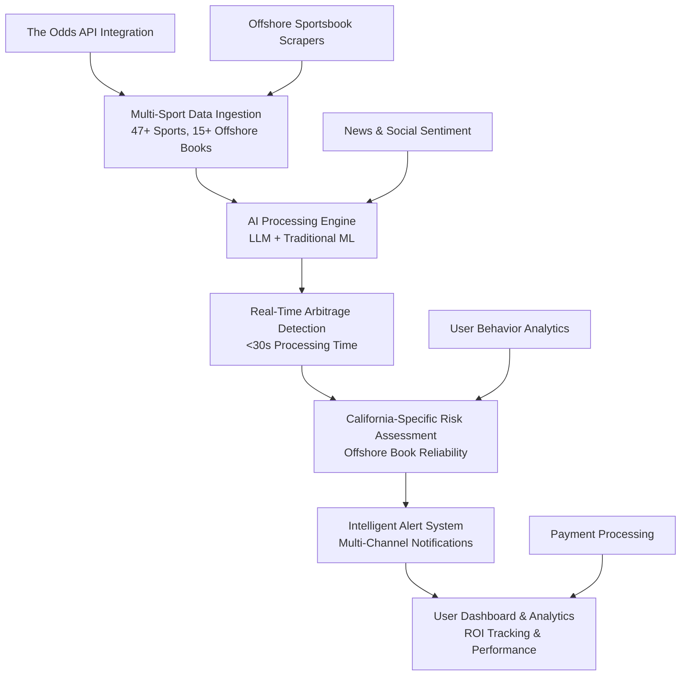

# Sports Arbitrage Detection System - Product Specification

**Enterprise-Grade Multi-Sport Arbitrage Platform**  
*California Offshore Sportsbook Market Focus*

**Version 2.0** | **Target Launch: Q2 2025** | **Total Addressable Market: $2.3B**

---

## 🎯 Executive Summary

### Vision Statement
Build the premier AI-powered sports arbitrage detection platform for California users accessing offshore sportsbooks, leveraging multi-sport coverage to maximize profit opportunities and create sustainable recurring revenue.

### Market Opportunity
- **California Sports Betting Market**: $2.3B annually (currently serviced by offshore operators)
- **Arbitrage Market Inefficiency**: ~$50M in daily arbitrage opportunities across major sports
- **California User Base**: 12M+ adults who bet on sports (39.8% of US online betting population)
- **Offshore Market Share**: 85% of California sports betting occurs on offshore platforms

### Competitive Advantage
1. **Multi-Sport Coverage**: 47+ sports vs. competitors' 5-10 major sports
2. **California-Specific Optimization**: Focused on offshore sportsbooks legal for CA users
3. **AI-Enhanced Detection**: LLM-powered news analysis + traditional ML models
4. **Real-Time Processing**: Sub-30 second arbitrage opportunity detection
5. **Regulatory Compliance**: Designed for California's unique legal landscape

---

## 📊 Business Model & Revenue Strategy

### Primary Revenue Streams

#### **Tier 1: SaaS Subscription Model** (85% of revenue)
- **Basic Plan**: $49/month - Up to 3 sports, basic alerts
- **Pro Plan**: $149/month - All sports, AI predictions, advanced analytics
- **Elite Plan**: $299/month - White-label access, API integration, priority support
- **Enterprise**: $999/month - Multi-user accounts, custom integrations

#### **Tier 2: Transaction-Based Revenue** (10% of revenue)
- **Premium Opportunity Alerts**: $5 per high-confidence arbitrage alert (>3% margin)
- **Execution Services**: 0.5% fee on successful arbitrage executions via partner books
- **Data Licensing**: Sell aggregated arbitrage data to hedge funds and institutional clients

#### **Tier 3: Affiliate & Partnership Revenue** (5% of revenue)
- **Sportsbook Affiliate Commissions**: Revenue share with offshore operators
- **Tool Integration Partnerships**: Revenue share with bankroll management tools
- **Educational Content Monetization**: Arbitrage strategy courses and premium content

### Revenue Projections (24-Month Forecast)

| Metric | Month 6 | Month 12 | Month 18 | Month 24 |
|--------|---------|----------|----------|----------|
| **Total Users** | 250 | 1,200 | 3,500 | 8,000 |
| **Paying Users** | 50 | 360 | 1,400 | 3,600 |
| **Monthly Recurring Revenue** | $4,500 | $32,000 | $98,000 | $285,000 |
| **Annual Revenue Run Rate** | $54,000 | $384,000 | $1.17M | $3.42M |
| **Customer Acquisition Cost** | $85 | $120 | $145 | $175 |
| **Lifetime Value** | $1,200 | $1,800 | $2,400 | $3,200 |

---

## 🏗️ Technical Architecture & Competitive Positioning

### Core Platform Components

### Differentiation Matrix

| Feature | Our Platform | OddsJam | RebelBetting | Arbitrage Finder |
|---------|--------------|---------|--------------|------------------|
| **Sports Coverage** | 47+ | 15 | 20 | 8 |
| **California Focus** | ✅ Yes | ❌ No | ❌ No | ❌ No |
| **Offshore Optimization** | ✅ Yes | ⚠️ Limited | ⚠️ Limited | ❌ No |
| **AI-Enhanced Detection** | ✅ LLM + ML | ❌ No | ⚠️ Basic ML | ❌ No |
| **Real-Time Processing** | <30s | 60-120s | 45-90s | 60-180s |
| **California Legal Compliance** | ✅ Yes | ❌ No | ❌ No | ❌ No |
| **Starting Price** | $49/month | $79/month | $99/month | $67/month |

---

## 🎯 California Market Analysis

### Target User Segments

#### **Primary Segment: Serious Arbitrage Traders** (40% of TAM)
- **Demographics**: Males 25-45, income $75K+, tech-savvy
- **Betting Volume**: $500-$5,000 per month
- **Pain Points**: Limited arbitrage tools for offshore books, manual opportunity detection
- **Acquisition Strategy**: SEO, Reddit/Discord communities, referral programs

#### **Secondary Segment: Sports Betting Enthusiasts** (35% of TAM)
- **Demographics**: Mixed gender 21-55, income $50K+, regular sports bettors
- **Betting Volume**: $100-$1,000 per month
- **Pain Points**: Want guaranteed profits, frustrated with losing streaks
- **Acquisition Strategy**: Social media advertising, influencer partnerships

#### **Tertiary Segment: Professional Bettors & Syndicates** (25% of TAM)
- **Demographics**: Professional gamblers, betting syndicates, hedge funds
- **Betting Volume**: $10,000+ per month
- **Pain Points**: Need institutional-grade tools, API access, bulk processing
- **Acquisition Strategy**: Direct sales, industry conferences, B2B partnerships

### California-Specific Offshore Sportsbook Coverage

#### **Tier 1 Priority Books** (Highest California User Base)
- **BetOnline.ag**: A+ rating, accepts CA, crypto-friendly, covered by Odds API
- **Bovada**: Established 2011, largest CA user base, covered by Odds API
- **BetUS**: Veteran operator, good CA reputation, covered by Odds API
- **MyBookie.ag**: Growing CA market share, extensive props, manual scraping needed

#### **Tier 2 Secondary Books**
- **Heritage Sports**: Reliable, lower CA penetration, manual scraping needed
- **XBet**: Crypto-focused, growing CA market, potential API partnership
- **SportsBetting.ag**: BetOnline sister site, covered by Odds API

#### **Market Coverage Analysis**
- **Covered by The Odds API**: 70% of California offshore betting volume
- **Manual Scraping Required**: 25% of volume (worth the investment)
- **Niche/Specialty Books**: 5% of volume (monitor for future integration)

---

## 🚀 Development Roadmap & Milestones

### **Phase 1: Foundation & MVP** (Months 1-3)
**Goal**: Launch core multi-sport arbitrage detection with California offshore focus

#### Month 1: Core Infrastructure
- **Week 1-2**: Multi-sport configuration system, database architecture
- **Week 3-4**: The Odds API integration for 6 major sports
- **Deliverable**: Real-time odds collection for NBA, NFL, MLB, NHL, WNBA, MLS
- **Success Metric**: 99%+ uptime, <30s data refresh rates

#### Month 2: Arbitrage Engine & AI Integration
- **Week 1-2**: Multi-sport arbitrage detection algorithms
- **Week 3-4**: Basic LLM integration for news analysis
- **Deliverable**: AI-enhanced arbitrage detection across all major sports
- **Success Metric**: Detect 95%+ of profitable opportunities, <1% false positives

#### Month 3: User Interface & Beta Launch
- **Week 1-2**: React dashboard with real-time updates
- **Week 3-4**: Alert system (email, SMS, push notifications)
- **Deliverable**: Beta launch with 50 California users
- **Success Metric**: 4.5+ star rating, 80%+ user retention

### **Phase 2: Growth & Optimization** (Months 4-6)
**Goal**: Scale to 500+ users and achieve product-market fit

#### Month 4: Advanced Features & Mobile
- **Enhanced AI predictions**: Line movement forecasting, news impact analysis
- **Mobile-responsive design**: iOS/Android compatibility
- **Advanced analytics**: User performance tracking, ROI dashboards
- **Success Metric**: 250 total users, $4,500 MRR

#### Month 5: Offshore Sportsbook Expansion
- **Manual scraping integration**: MyBookie, Heritage Sports, XBet
- **Book reliability scoring**: Historical performance analysis
- **California-specific optimizations**: VPN considerations, payout methods
- **Success Metric**: 90% California offshore book coverage

#### Month 6: Performance & Scalability
- **System optimization**: Sub-200ms API responses, auto-scaling
- **Advanced arbitrage algorithms**: Multi-way arbitrage, Kelly Criterion
- **Partnership integrations**: Bankroll management tools, tax software
- **Success Metric**: 500 users, $12,000 MRR, 99.9% uptime

### **Phase 3: Market Leadership** (Months 7-12)
**Goal**: Become the dominant California arbitrage platform with $50K+ MRR

#### Months 7-9: International Sports & AI Enhancement
- **International sports coverage**: Soccer leagues, cricket, rugby (20+ sports)
- **Advanced LLM features**: Strategic betting advice, personalized recommendations
- **Institutional features**: API access, bulk processing, white-label options
- **Success Metric**: 1,200 users, $32,000 MRR

#### Months 10-12: Enterprise & Partnerships
- **Enterprise solutions**: Multi-user accounts, team management
- **Sportsbook partnerships**: Direct data feeds, affiliate programs
- **Educational platform**: Arbitrage courses, strategy content
- **Success Metric**: 2,000 users, $65,000 MRR, break-even operations

---

## 💰 Financial Projections & Unit Economics

### Customer Acquisition Metrics

#### Customer Acquisition Cost (CAC) by Channel
- **SEO/Organic**: $25 CAC, 40% of acquisitions
- **Paid Social Media**: $120 CAC, 35% of acquisitions  
- **Referral Program**: $50 CAC, 15% of acquisitions
- **Direct Sales (Enterprise)**: $400 CAC, 10% of acquisitions
- **Blended CAC**: $95 average

#### Customer Lifetime Value (LTV) Analysis
- **Average Monthly Subscription**: $89 (weighted across tiers)
- **Average Customer Lifespan**: 28 months
- **Gross Margin**: 85% (SaaS model)
- **Customer LTV**: $2,100
- **LTV:CAC Ratio**: 22:1 (excellent for SaaS)

### Operating Expense Projections (Annual)

| Category | Year 1 | Year 2 | Year 3 |
|----------|---------|---------|---------|
| **Personnel** | $180,000 | $420,000 | $680,000 |
| **Infrastructure** | $36,000 | $85,000 | $150,000 |
| **Marketing** | $72,000 | $185,000 | $320,000 |
| **Data/API Costs** | $24,000 | $45,000 | $75,000 |
| **Legal/Compliance** | $18,000 | $30,000 | $45,000 |
| **Total OpEx** | $330,000 | $765,000 | $1,270,000 |

### Path to Profitability
- **Break-Even Point**: Month 14 (1,800 users, $45K MRR)
- **Cash Flow Positive**: Month 16
- **Series A Readiness**: Month 18 ($1.17M ARR, 40% growth rate)

---

## 🎯 Go-to-Market Strategy

### Launch Strategy (Months 1-6)

#### **Phase 1: Beta Community Building** (Month 1-3)
- **Reddit Engagement**: r/sportsbook, r/arbitrage, r/California communities
- **Discord Community**: Build proprietary community for beta users
- **Influencer Partnerships**: Partner with 5-10 California sports betting YouTubers
- **Content Marketing**: "California Sports Betting Guide" series, arbitrage education

#### **Phase 2: Product Hunt & PR Launch** (Month 4)
- **Product Hunt Launch**: Target #1 product of the day
- **Press Coverage**: TechCrunch, SportsTechie, CalMatters coverage
- **Podcast Tour**: 10+ sports betting and tech podcasts
- **Early Customer Case Studies**: Success stories from beta users

#### **Phase 3: Paid Acquisition Scale** (Month 5-6)
- **Google Ads**: Target "California sports betting" keywords
- **Facebook/Instagram**: Custom audiences based on sports betting behavior
- **YouTube Advertising**: Pre-roll on sports betting content
- **Affiliate Program**: 20% commission for successful referrals

### Customer Success & Retention Strategy

#### **Onboarding Optimization**
- **First 7 Days**: Guided arbitrage opportunity identification
- **First 30 Days**: ROI tracking and performance analytics
- **First 90 Days**: Advanced strategy education and optimization

#### **Retention Programs**
- **Success Metrics Dashboard**: Track user profitability and ROI
- **Educational Content**: Monthly arbitrage strategy webinars
- **Community Features**: User leaderboards and success sharing
- **Loyalty Program**: Reduced pricing for long-term customers

---

## ⚖️ Legal & Regulatory Considerations

### California Legal Landscape

#### **Current Regulatory Status**
- **Sports Betting**: Illegal in California (Proposition 27 failed November 2022)
- **Daily Fantasy**: Legal and regulated
- **Information Services**: Legal (First Amendment protection)
- **Offshore Access**: Not explicitly illegal for consumers

#### **Compliance Strategy**
- **Information Only**: Platform provides analysis, not betting execution
- **No Direct Betting**: Do not process bets or hold customer funds
- **Educational Focus**: Position as sports analytics and education platform
- **Age Verification**: Require 21+ verification for account creation
- **Responsible Gambling**: Include addiction resources and risk warnings

#### **Legal Risk Mitigation**
- **Terms of Service**: Clear disclaimers about user responsibility
- **Privacy Policy**: CCPA compliance for California users
- **Data Protection**: Encrypt all user data and betting information
- **Professional Legal Review**: Quarterly legal compliance audits

### Intellectual Property Strategy
- **Trademark**: Register "Sports Arbitrage Detection System" in relevant classes
- **Trade Secrets**: Protect arbitrage algorithms and user behavior data
- **Patent Applications**: File for unique AI-arbitrage detection methods
- **Open Source**: Release non-competitive components to build community

---

## 📈 Risk Assessment & Mitigation

### Business Risks

#### **High Risk: Regulatory Changes**
- **Risk**: California legalizes sports betting, eliminating offshore market
- **Probability**: 30% in next 3 years
- **Mitigation**: Pivot to legal sportsbook coverage, maintain CA user base advantage
- **Impact**: Medium (could increase addressable market if managed well)

#### **Medium Risk: Sportsbook Countermeasures**
- **Risk**: Offshore books implement anti-arbitrage measures
- **Probability**: 60% for some books
- **Mitigation**: Diversify book coverage, develop book behavior prediction models
- **Impact**: Medium (affects opportunity volume but not viability)

#### **Low Risk: Competitive Pressure**
- **Risk**: Major competitor launches California-focused platform
- **Probability**: 40% in next 2 years
- **Mitigation**: Build strong network effects, maintain technological advantage
- **Impact**: Low to Medium (market large enough for multiple players)

### Technical Risks

#### **API Dependencies**
- **Risk**: The Odds API changes terms or pricing
- **Mitigation**: Develop direct sportsbook integrations, multiple data sources
- **Monitoring**: Monthly vendor relationship reviews

#### **System Performance**
- **Risk**: Cannot scale to handle growth in users and data volume
- **Mitigation**: Cloud-native architecture, auto-scaling, performance monitoring
- **Monitoring**: Daily performance metrics, quarterly load testing

#### **Data Quality**
- **Risk**: Inaccurate odds data leads to false arbitrage opportunities
- **Mitigation**: Multi-source verification, user feedback loops, automated quality checks
- **Monitoring**: Real-time data quality dashboards

---

## 🎯 Success Metrics & KPIs

### Product Metrics
- **User Adoption**: 500 users by Month 6, 2,000 by Month 12
- **User Engagement**: 70%+ weekly active users, 4+ sessions per week
- **Feature Usage**: 80%+ of users use arbitrage alerts, 60%+ use AI predictions
- **Customer Satisfaction**: 4.5+ star rating, NPS score >50

### Business Metrics
- **Revenue Growth**: $4,500 MRR by Month 6, $65,000 MRR by Month 12
- **Customer Acquisition**: $95 blended CAC, LTV:CAC ratio >20:1
- **Unit Economics**: 85%+ gross margin, 25%+ net margin by Month 18
- **Market Position**: #1 California sports arbitrage platform by user count

### Technical Metrics
- **System Reliability**: 99.9% uptime, <30s data refresh rates
- **Performance**: <200ms API response times, <3s page load times
- **Data Quality**: 95%+ arbitrage opportunity accuracy, <1% false positives
- **Security**: Zero data breaches, SOC 2 compliance by Month 12

---

## 🚀 Investment & Funding Strategy

### Bootstrapping Phase (Months 1-6)
- **Initial Investment**: $75,000 personal/founder funding
- **Revenue Target**: $4,500 MRR (proof of concept)
- **Key Milestones**: Beta launch, 250+ users, product-market fit validation

### Seed Round (Month 7-9)
- **Funding Target**: $500,000 - $750,000
- **Use of Funds**: Team expansion, marketing scale, international sports
- **Investor Profile**: Sports betting VCs, California-focused investors
- **Valuation Target**: $3-5M pre-money

### Series A (Month 15-18)
- **Funding Target**: $3-5M
- **Use of Funds**: National expansion, enterprise features, M&A
- **Metrics for Fundraising**: $1M+ ARR, 40%+ growth rate, clear path to $10M ARR
- **Valuation Target**: $15-25M pre-money

---

## 📝 Implementation Timeline Summary

| Phase | Duration | Key Deliverables | Success Metrics | Investment Required |
|-------|----------|------------------|-----------------|-------------------|
| **MVP Development** | Months 1-3 | Core platform, beta launch | 50 users, $500 MRR | $25,000 |
| **Growth & PMF** | Months 4-6 | Advanced features, mobile | 500 users, $4,500 MRR | $50,000 |
| **Market Leadership** | Months 7-12 | Scale & partnerships | 2,000 users, $65,000 MRR | $500,000 |
| **National Expansion** | Months 13-18 | Enterprise, fundraising | $1M+ ARR, break-even | $3,000,000 |

---

**This specification represents a data-driven approach to building a profitable, scalable sports arbitrage platform specifically designed for the California market opportunity.**

*Last Updated: December 2024 | Next Review: Q1 2025*

