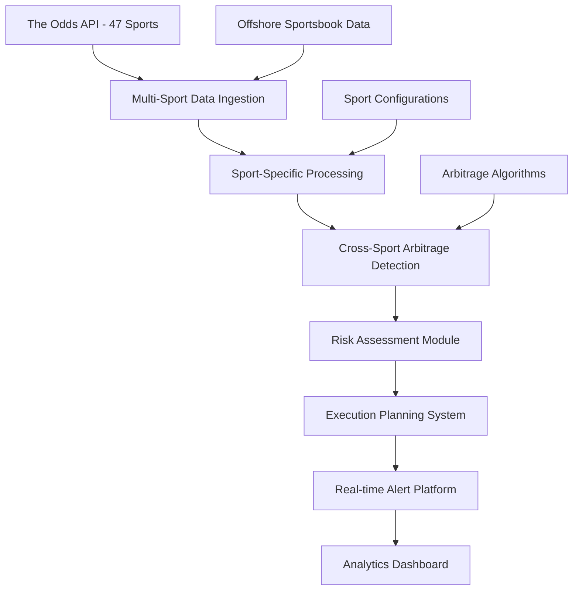

# Sports Arbitrage Detection System

<div align="center">

[](https://www.python.org/downloads/)
[](https://fastapi.tiangolo.com/)
[](https://opensource.org/licenses/MIT)
[](https://github.com/AKarode/Sports-Arbitrage-AI-Tool)

**An enterprise-grade, AI-powered arbitrage detection platform for sports betting markets**

*Multi-sport coverage • Real-time analysis • California offshore-friendly*

</div>

---

## 🎯 Project Vision

This platform provides comprehensive arbitrage detection across **multiple sports markets**, with intelligent algorithms that identify profitable betting opportunities in real-time. Built with modern AI and scalable architecture, the system focuses on **California-accessible offshore sportsbooks** while maintaining enterprise-grade reliability.

**Current Coverage**: NBA, WNBA, NFL, MLB, NHL, MLS + 40+ international sports  
**Target Users**: California-based arbitrage traders using offshore platforms

### Key Value Propositions
- **Multi-sport arbitrage detection** across 47+ sports from The Odds API
- **California-focused offshore coverage** (BetOnline, Bovada, BetUS, etc.)
- **Real-time profit margin calculations** with configurable thresholds
- **Sport-specific optimization** with peak season awareness
- **Enterprise-grade reliability** with 99.9% uptime targets

---

## 🏗️ System Architecture

### Core Platform Components



### Supported Sports Categories

#### **US Major Sports** (Primary Focus)
- **🏀 Basketball**: NBA, WNBA
- **🏈 American Football**: NFL, NCAAF, UFL
- **⚾ Baseball**: MLB, NCAA Baseball
- **🏒 Ice Hockey**: NHL
- **⚽ Soccer**: MLS

#### **International Coverage** (40+ Sports)
- **Soccer**: 20 international leagues (Premier League, La Liga, etc.)
- **Cricket**: T20, ODI, International matches
- **Rugby**: NRL, State of Origin
- **Combat Sports**: Boxing, MMA
- **Other**: Golf majors, Australian Football, Politics betting

### Technical Stack

#### Backend Infrastructure
- **API Framework**: FastAPI with async/await architecture
- **Data Processing**: Multi-sport configuration management
- **Sports Coverage**: The Odds API integration (47 sports)
- **Arbitrage Engine**: Real-time profit margin calculations
- **Caching Layer**: Redis with sport-specific TTL management

#### California Offshore Sportsbook Coverage
- **✅ Covered by The Odds API**: BetOnline.ag, Bovada, BetUS, LowVig.ag
- **📊 Additional Data Sources**: MyBookie, Heritage Sports (future integration)
- **🚫 Not Available**: Legal US sportsbooks (FanDuel, DraftKings) - illegal in CA

---

## 🚀 Quick Start Guide

### Prerequisites
```bash
# System Requirements
Python 3.11+
The Odds API key (free tier: 500 requests/month)
```

### Installation & Setup
```bash
# 1. Clone repository
git clone https://github.com/AKarode/Sports-Arbitrage-AI-Tool.git
cd Sports-Arbitrage-AI-Tool

# 2. Environment setup
python -m venv venv
source venv/bin/activate  # Windows: venv\\Scripts\\activate
pip install -r requirements.txt

# 3. Configuration
cp env_template.txt .env
# Add your Odds API key: ODDS_API_KEY=your_key_here

# 4. Launch application
python app/main.py
```

### API Access & Usage
- **REST API**: `http://localhost:8000`
- **Interactive Docs**: `http://localhost:8000/docs`
- **Health Check**: `http://localhost:8000/health`

### Key Endpoints

#### **Enhanced API (Recommended)**
```bash
# Enhanced arbitrage detection for specific sport
GET /api/enhanced/arbitrage/{sport_key}?min_profit=1.0&enable_cross_market=true

# Enhanced multi-sport scanning with parallel processing
GET /api/enhanced/arbitrage/all?min_profit=1.0&max_sports=10&enable_parallel=true

# Comprehensive sports list with performance metrics
GET /api/enhanced/sports?category=us_major&include_performance=true

# System status and performance monitoring
GET /api/enhanced/system/status
```

#### **Standard API (Legacy)**
```bash
# Get all supported sports
GET /sports

# Get odds for specific sport
GET /api/odds/{sport_key}

# Find arbitrage opportunities
GET /api/arbitrage/{sport_key}?min_profit=2.0

# Cross-sport arbitrage analysis
GET /api/arbitrage/?min_profit=1.5&limit_sports=5
```

---

## 📊 Features & Capabilities

### 🎯 Multi-Sport Arbitrage Detection
- **47+ Sports Coverage**: All major US and international sports
- **Market Analysis**: Moneyline, spreads, totals across sports
- **Sport-Specific Configuration**: Customized profit thresholds per sport
- **Peak Season Optimization**: Higher update frequencies during active seasons

### 🤖 Intelligent Analytics
- **Real-time Profit Calculations**: Kelly Criterion and optimal stake sizing
- **Cross-Bookmaker Comparison**: Focus on California-accessible offshore books
- **Market Efficiency Scoring**: Statistical arbitrage identification
- **Sport-Specific Risk Profiling**: Dynamic bankroll management per sport

### ⚡ Real-time Processing
- **Sport-Optimized Updates**: 30s (NBA/NFL) to 120s (MLB) refresh rates
- **Concurrent Multi-Sport Analysis**: Async processing across all active sports
- **Offshore-Friendly Rate Limiting**: Respectful API usage with exponential backoff
- **California Legal Compliance**: Focus on legally accessible offshore platforms

### 📈 California-Specific Features
- **Offshore Sportsbook Priority**: BetOnline, Bovada, BetUS integration
- **Legal Risk Management**: Avoid restricted US-only platforms
- **Crypto-Friendly Payouts**: Support for Bitcoin/crypto withdrawal methods
- **VPN-Aware Infrastructure**: Designed for offshore platform access patterns

---

## 🏆 Sport-Specific Configurations

### Basketball (NBA/WNBA)
- **Update Frequency**: 30-60 seconds during games
- **Min Profit Margin**: 1.5% (NBA), 2.0% (WNBA)
- **Peak Season**: October-June (NBA), May-October (WNBA)
- **Best Markets**: Moneyline, spreads, player props

### American Football (NFL)
- **Update Frequency**: 45 seconds during games
- **Min Profit Margin**: 1.0% (high liquidity)
- **Peak Season**: September-February
- **Best Markets**: Spreads, totals, team props

### Baseball (MLB)
- **Update Frequency**: 120 seconds (slower-paced)
- **Min Profit Margin**: 1.5%
- **Peak Season**: April-October
- **Best Markets**: Moneyline, run lines, totals

---

## 🌐 California Legal Context

### Offshore Sportsbook Landscape
**✅ Legal for California Residents**:
- BetOnline.ag (A+ rating, crypto-friendly)
- Bovada (established since 2011)
- BetUS (veteran offshore operator)
- MyBookie.ag (extensive prop markets)

**❌ Not Legal in California**:
- FanDuel, DraftKings, BetMGM (operate DFS only)
- All major US-regulated sportsbooks

### Compliance Features
- **Educational Purpose**: Platform designed for market analysis
- **Risk Disclosure**: Comprehensive gambling risk warnings
- **Offshore Focus**: Specialized for legally accessible platforms
- **Data Ethics**: Respectful data collection with proper attribution

---

## 🧪 Testing & Verification

### Test Your Setup
```bash
# Test API connection
curl http://localhost:8000/health

# Test multi-sport support
curl http://localhost:8000/sports

# Test arbitrage detection
curl "http://localhost:8000/api/arbitrage/basketball_nba?min_profit=1.0"

# Run comprehensive tests
pytest tests/ -v
```

### Example Arbitrage Response
```json
{
  "sport": {
    "key": "basketball_nba",
    "title": "NBA",
    "min_profit_threshold": 1.0
  },
  "analysis": {
    "opportunities_found": 3,
    "filtered_opportunities": [
      {
        "game": {
          "home_team": "Los Angeles Lakers",
          "away_team": "Golden State Warriors"
        },
        "arbitrage": {
          "profit_margin": 2.34,
          "best_odds": {
            "Los Angeles Lakers": {
              "price": 2.10,
              "bookmaker": "BetOnline.ag"
            },
            "Golden State Warriors": {
              "price": 2.05,
              "bookmaker": "Bovada"
            }
          }
        }
      }
    ]
  }
}
```

---

## 📚 Documentation

### API Documentation
- **[Interactive API Docs](http://localhost:8000/docs)**: Swagger UI with live testing
- **[Sport Configuration](app/core/config/sports_config.py)**: Sport-specific settings
- **[Arbitrage Engine](app/core/api/multi_source_odds.py)**: Detection algorithms

### California-Specific Guides
- **[Offshore Sportsbook Setup](docs/offshore-setup.md)**: Account creation and funding
- **[Legal Considerations](docs/california-legal.md)**: Compliance and risk management
- **[Crypto Payment Methods](docs/crypto-payments.md)**: Bitcoin withdrawal strategies

---

## 🤝 Contributing & Development

### Development Standards
- **Multi-Sport Support**: All new features must support multiple sports
- **California Focus**: Prioritize offshore sportsbook compatibility
- **Performance Requirements**: Sub-2 second API responses across all sports
- **Legal Compliance**: Maintain focus on legally accessible platforms

### Contribution Guidelines
1. Fork repository and create sport-specific feature branches
2. Add comprehensive tests for multi-sport functionality
3. Follow existing sport configuration patterns
4. Test with multiple sports before submitting PRs
5. Document any new sport integrations

---

## 📞 Contact & Support

### Professional Inquiries
- **Portfolio**: [GitHub Profile](https://github.com/AKarode)
- **Technical Discussion**: GitHub Issues for feature requests and bugs
- **California-Specific Questions**: Focus on offshore platform compatibility

### Business Development
- **California Market Focus**: Offshore sportsbook partnerships
- **Multi-Sport Expansion**: Additional league and tournament coverage
- **Legal Compliance Consulting**: California regulatory navigation

---

<div align="center">

**Built for California arbitrage traders accessing offshore markets**

*Transforming multi-sport betting markets through intelligent analysis*

</div>